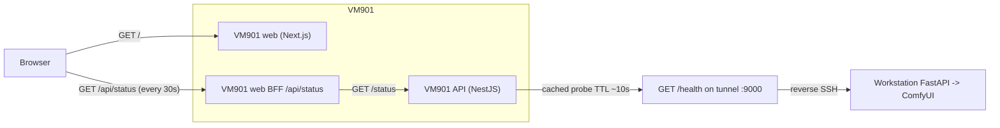

# Site availability when the GPU worker is OFF (Phase 1)

The Estio site has a hard runtime dependency on the GPU worker for everything that costs credits:
text-to-image, image-to-video, text-to-video, and the "Buy credits" CTA. The worker today is the
workstation, reachable from the control plane (VM901) only via an SSH reverse tunnel that the
workstation itself initiates. When that tunnel is healthy, those features work; when it isn't,
the whole site used to fail silently — image jobs hung for 60s+, then surfaced opaque 502/504s,
and "Buy credits" stayed clickable but produced timeouts.

Phase 1 fixes the silent-failure side end-to-end while keeping the three-VM architecture
(VM900 = GPU worker / today the workstation, VM901 = control plane, VM902 = database) intact.

## Architecture



## Server-side contract

- `GET /status` (NestJS API, public): returns
  ```json
  {
    "gpu": {
      "online": true,
      "lastCheckedAt": "2026-04-18T12:34:56.789Z",
      "latencyMs": 17,
      "reason": null
    }
  }
  ```
  When the worker is unreachable, `online` is `false` and `reason` is one of
  `unconfigured | timeout | unreachable | dns | upstream_http_<code> | network_<code>`.
- The probe is cached in-process for `STATUS_PROBE_TTL_MS` (default **10000** ms). A noisy front
  page therefore generates at most one upstream `/health` call per 10 s.
- Pass `?force=1` to bypass the cache (operator/debug only — do **not** wire this to the
  Studio UI, that would defeat the cache).
- Implementation: `apps/api/src/modules/status/status.service.ts` and `status.controller.ts`,
  registered in `apps/api/src/app.module.ts`.

## Submit-handler precheck (fast-fail)

- `POST /media/jobs`, `POST /media/jobs/generate-image`, `POST /media/jobs/generate-media` and
  the legacy sync `POST /media/generate-image` all call `StatusService.isWorkerOnlineFast()` at
  the top.
- When the cached probe says offline, they reject with **`503`** and body
  ```json
  { "code": "WORKER_OFFLINE", "message": "GPU services are temporarily offline. Please try again later.", "reason": "<probe-reason>" }
  ```
  in well under 1 ms instead of letting Axios burn 60 s+ on a dead tunnel.
- The web app maps that `503` to the same `GpuOfflineBanner` as the polling signal.

## Bull retry tightening (transient submit failures)

- `MediaJobsService.runProcessor` now receives `{ isLastAttempt }` from the Bull worker and uses
  Bull's `attempts: 2` for real: when the worker call throws a transient error
  (`GatewayTimeoutException`, `BadGatewayException("Cannot reach …")`, or our own
  `ServiceUnavailableException({ code: "WORKER_OFFLINE" })`) AND we are not on the last attempt,
  the job row is reset to `queued` and the error is re-thrown so Bull retries (`backoff:
  exponential delay 3000`, well within `lockDuration`).
- Polling-stage failures (after a `workerRemoteJobId` was issued) are NOT retried at this layer
  — that path keeps the existing terminal-`failed` semantics so we don't orphan workstation
  jobs.

## Client-side gating

- `apps/web/lib/use-gpu-status.ts` polls `/api/status` every 30 s, with exponential back-off up
  to 120 s on fetch errors and visibility-aware pause/resume.
- `apps/web/components/ai-studio/gpu-offline-banner.tsx` is a small shared banner (en + ar copy
  inline) rendered above:
  - `unified-media-generation-panel.tsx` (Studio image / video tabs)
  - `tiered-video-generation-panel.tsx` (preview / standard / premium video chain)
  - `studio-credits-panel.tsx` ("Buy credits" CTA)
- When `gpu.online === false`, the panels:
  - render the banner above the form,
  - disable the primary CTA (`Generate`, `Buy credits`, `Upgrade to Standard/Premium`) and
    surface the localized tooltip "GPU services are temporarily offline — please try again in
    a few minutes." (Arabic equivalent provided).
- The banner clears within one poll cycle (≤ 30 s) once `/api/status` reports `gpu.online: true`
  again. Users can also revisit the tab to force an immediate refresh (visibility-change hook).

## Per-VM responsibilities (no architectural changes in Phase 1)

- **VM900 (today: workstation, GPU host).**
  Continue running the FastAPI worker on its local port (default `127.0.0.1:8000`) in front of
  ComfyUI. The workstation initiates `ssh -R 0.0.0.0:9000:127.0.0.1:<worker-port>` to VM901.
  See `deploy/WORKSTATION_TUNNEL_FIX.md` for the one-time cleanup of the obsolete `:19000`
  forward — the only outstanding action is on the workstation.
- **VM901 (control plane).**
  Hosts the NestJS API, Next.js web/admin, Redis, and the SSH listener that terminates the
  reverse tunnel on `0.0.0.0:9000`. `MEDIA_WORKER_URL` and `MEDIA_JOB_VIEW_PROXY_UPSTREAM` are
  pinned to `http://host.docker.internal:9000`. The optional socat shim
  (`deploy/systemd/estio-docker-worker-bridge.service`) is **disabled** by default in this mode
  (sshd's `GatewayPorts clientspecified` already publishes the listener on 0.0.0.0). The unit
  file is preserved as the documented escape hatch for environments stuck on loopback-only `-R`.
- **VM902 (database).**
  No changes in Phase 1. No migrations.

## Verification checklist (run on VM901 after deploy)

```bash
# 1) Status endpoint, public, returns the cached snapshot.
curl -sS https://api.estio.org/status | jq .gpu

# 2) The API container can actually reach the worker via host.docker.internal.
docker compose -f docker-compose.prod.yml exec api node -e \
  "fetch('http://host.docker.internal:9000/health').then(r=>r.text()).then(console.log).catch(e=>{console.error(e.message);process.exit(1)})"

# 3) Force a fresh probe (bypasses the 10s cache) — should match #2 within a few ms.
curl -sS 'https://api.estio.org/status?force=1' | jq .gpu

# 4) Fast-fail behaviour. Stop the workstation FastAPI, wait ~12s for the cache to expire.
#    Then submit a job. It should return 503 in <100ms, NOT a 60s+ Axios timeout.
time curl -sS -X POST https://api.estio.org/media/jobs \
  -H 'Content-Type: application/json' \
  -d '{"mode":"text_to_image","prompt":"availability smoke test"}'
# Expected body: { "code": "WORKER_OFFLINE", "message": "GPU services are temporarily offline...", "reason": "..." }
# Expected: real time well under 1s.

# 5) Banner UX: open https://estio.org/ -> Studio. With FastAPI stopped on the workstation,
#    the "GPU services are temporarily offline" banner appears above the form within ~30s
#    and the Generate / Buy credits buttons are disabled (and aria-disabled).
#    Restart FastAPI on the workstation; the banner disappears within one poll cycle.
```

## Out of scope for Phase 1

Phase 1 is intentionally narrow:

- No payments code, no credit ledger, no user accounts, no SIWE.
- No email / SMS integration ("notify me when ready" deferred to Phase 3).
- No Postgres migrations on VM902.
- No architectural moves (e.g. moving the GPU off the workstation to a real VM900). That is a
  separate, larger discussion. The plan keeps the current single-node deployment with
  workstation-as-GPU-source.

Phase 2 outline (separate PR): on-chain USDC on Base + SIWE login, real `/payments/*` endpoints,
`User`/`CreditPack`/`Payment`/`CreditLedger` models, debit on job submit. Phase 3 outline
(separate PR): "notify me when ready" toggle wired to a notification provider once we have a
user identity. Both are designed in the plan file but not built in this round.
